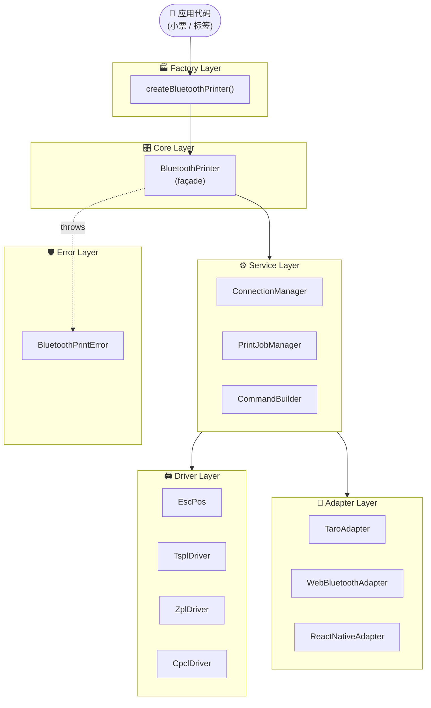

<div align="center">


# taro-bluetooth-print

**轻量级、高性能的 Taro 跨端蓝牙打印库**

*一套代码，七大平台全覆盖；八种打印协议，开箱即用。*

[](https://www.npmjs.com/package/taro-bluetooth-print)
[](https://www.npmjs.com/package/taro-bluetooth-print)
[](https://bundlephobia.com/package/taro-bluetooth-print)
[](https://github.com/agions/taro-bluetooth-print/blob/main/LICENSE)
[](https://github.com/agions/taro-bluetooth-print)
[](https://github.com/agions/taro-bluetooth-print/actions)

[🚀 快速开始](#-快速开始) · [📖 完整文档](https://agions.github.io/taro-bluetooth-print/) · [🧩 在线示例](https://github.com/Agions/taro-bluetooth-print/tree/main/examples) · [💬 讨论](https://agions.github.io/taro-bluetooth-print/guide/discussions)

</div>

---

## ✨ 为什么选择 taro-bluetooth-print

> 一个库，一套 API，覆盖**所有主流蓝牙打印机**与**所有 Taro 目标平台**。
> 零运行时依赖 · TypeScript 严格模式 · 完整类型定义 · 全栈分层架构。

### 🛰️ **跨七平台、一处编写到处打印**

不再为每个小程序平台写一份蓝牙适配代码——`TaroAdapter` / `AlipayAdapter` / `BaiduAdapter` / `ByteDanceAdapter` / `QQAdapter` / `WebBluetoothAdapter` / `ReactNativeAdapter` 共享统一 API，统统由 `AdapterFactory.create()` 自动 dispatch。

### 🖨️ **八大驱动协议、商米到 Zebra 全场景**

| 协议 | 驱动类 | 适用机型 |
|:---:|:---|:---|
| **ESC/POS** | `EscPos` | 佳博、芯烨、商米、汉印、思普瑞特 |
| **TSPL** | `TsplDriver` | TSC ME240 / TA210 / TTP-244 等标签机 |
| **ZPL** | `ZplDriver` | Zebra ZD420 / GT800 / ZM400（含 ^GFA 图像） |
| **CPCL** | `CpclDriver` | HP IR3222、霍尼韦尔移动机（含 CG Logo 下载） |
| **STAR** | `StarPrinter` | STAR TSP100 / TSP700 / TSP800 |

### 🧠 **完备的业务能力栈**

`PrintQueue` 优先级调度 → `PrintJobManager` 状态机 → `OfflineCache` LRU + Base64 持久化 → `ScheduledRetryManager` 指数退避 → `PrintScheduler` Cron 调度 → `PrintHistory` 全链路统计 → `PluginManager` Hook 系统——把企业级打印场景抽象成可组合的 primitive。

### 💎 **TypeScript 严格模式 · 零运行时依赖**

- ✅ 整个库 **0 个生产依赖**（仅 peerDep `@tarojs/taro ^3.6.22`）
- ✅ 严格类型契约 (`IPrinterDriver` / `IPrinterAdapter`)，IDE 自动补全
- ✅ **1,436 个测试**全绿 · **jscpd 0 重复** · **零 dead code**

---

## 🚀 快速开始

### 📦 安装

```bash
# npm
npm install taro-bluetooth-print

# pnpm（推荐）
pnpm add taro-bluetooth-print

# yarn
yarn add taro-bluetooth-print
```

> **前置依赖**：项目需安装 `@tarojs/taro ^3.6.22` 及以上版本。

### ⚡ 30 秒打印一张小票

```typescript
import { createBluetoothPrinter, WebBluetoothAdapter } from 'taro-bluetooth-print';

// ① 创建打印机（自动 dispatch 当前平台适配器）
const printer = createBluetoothPrinter({
  adapter: new WebBluetoothAdapter(),
});

// ② 连接 BLE 设备
await printer.connect('device-id-xxx');

// ③ 链式 API 构建小票
await printer
  .text('=== 欢迎光临 ===', 'GBK')
  .feed()
  .text('商品A     x1    ¥10.00', 'GBK')
  .text('商品B     x2    ¥20.00', 'GBK')
  .feed()
  .text('------------------------')
  .text('合计：            ¥30.00', 'GBK')
  .feed(2)
  .qr('https://example.com', { size: 6 })
  .feed(2)
  .cut()
  .print();

// ④ 断开
await printer.disconnect();
```

---

## 🏗️ 架构设计

一个清晰的 6 层架构，每层只对相邻层有依赖，**严格遵循依赖倒置**：



> 💡 每一层都可独立测试、独立替换。`PluginManager` 通过 hook 横切所有层。

---

## 📱 平台支持

| 平台 | 适配器 | 状态 |
|:---|:---|:---:|
| 微信小程序 | `TaroAdapter` | ✅ |
| 支付宝小程序 | `AlipayAdapter` | ✅ |
| 百度智能小程序 | `BaiduAdapter` | ✅ |
| 字节跳动小程序 | `ByteDanceAdapter` | ✅ |
| QQ 小程序 | `QQAdapter` | ✅ |
| H5（Web Bluetooth） | `WebBluetoothAdapter` | ✅ |
| React Native | `ReactNativeAdapter` | ✅ |
| 鸿蒙 HarmonyOS | `TaroAdapter` | ✅ |

---

## ⚙️ 传输参数 & 事件

### 传输调优

```typescript
printer.setOptions({
  chunkSize: 20,   // 单次 BLE 写入分片（默认 20）
  delay: 20,       // 分片间隔 ms（默认 20）
  retries: 3,      // 失败重试（默认 3）
});
```

### 事件订阅

```typescript
printer.on('progress', ({ sent, total }) => {
  console.log(`打印进度 ${((sent / total) * 100).toFixed(1)}%`);
});
printer.on('error', err => console.error('打印错误:', err.code, err.message));
printer.on('print-complete', () => console.log('✅ 打印完成'));
```

---

## 🛡️ 类型化错误处理

```typescript
import {
  BluetoothPrintError, ConnectionError, PrintJobError,
  CommandBuildError, ErrorCode,
} from 'taro-bluetooth-print';

try {
  await printer.connect(deviceId);
} catch (err) {
  if (ConnectionError.isConnectionError(err)) {
    // 连接层 — 提示用户重试 / 切换设备
  } else if (PrintJobError.isPrintJobError(err)) {
    // 任务层 — 重新入队
  } else if (CommandBuildError.isCommandBuildError(err)) {
    // 指令层 — 检查参数
  } else if (err instanceof BluetoothPrintError) {
    // 兜底 — 任意已封装错误
  }
}
```

---

## 🔌 插件系统

无需侵入核心代码即可横切打印生命周期：

```typescript
import { PrinterFactory, createLoggingPlugin, createRetryPlugin } from 'taro-bluetooth-print';

const printer = createBluetoothPrinter({ adapter: new WebBluetoothAdapter() });

printer.use(createLoggingPlugin({ level: 3 }));
printer.use(createRetryPlugin({ maxRetries: 3, backoffMultiplier: 2 }));

// Also built-in:
// · Logger plugin  · Retry plugin
// · Or roll your own — see PluginManager docs
```

钩子集：`beforeConnect` · `afterConnect` · `beforeDisconnect` · `afterDisconnect` · `beforePrint` · `afterPrint` · `onError` · `onStateChange` · `onProgress`

---

## 📊 项目指标

| 维度 | 数值 |
|:---|:---|
| 包体积（main bundle） | **89 KB / 25.5 KB gzip**（v2.15.4+，GBK 表按需懒加载） |
| 测试用例 | **1,436** 个，全绿 |
| 代码重复 | **jscpd 0 clones** |
| 死代码 | **0 行** |
| TypeScript any 暴露 | **0 处** |
| 架构模式 | Template Method · Mixin · Facade · Strategy · EventEmitter |
| 模块数 | 14 个清晰分层 |
| API 公开方法 | 100+ 全部类型化 |

---

## 📖 完整文档

| 入口 | 链接 |
|:---|:---|
| 快速开始 | [agions.github.io/taro-bluetooth-print/guide/getting-started](https://agions.github.io/taro-bluetooth-print/guide/getting-started) |
| 功能详解 | [/guide/features](https://agions.github.io/taro-bluetooth-print/guide/features) |
| 驱动支持 | [/guide/drivers](https://agions.github.io/taro-bluetooth-print/guide/drivers) |
| 架构设计 | [/guide/architecture](https://agions.github.io/taro-bluetooth-print/guide/architecture) |
| API 参考 | [/api/](https://agions.github.io/taro-bluetooth-print/api/) |
| FAQ | [/guide/faq](https://agions.github.io/taro-bluetooth-print/guide/faq) |

---

## 🧪 示例项目

完整的跨平台打印示例，覆盖微信小程序 / H5 / 鸿蒙 HarmonyOS / React Native 四大平台。

| 平台 | 适配器 | 示例文件 | 文档 |
|:---|:---|:---|:---|
| 微信小程序 | `TaroAdapter` | [`printer-page.tsx`](./examples/weapp/printer-page.tsx) | [README](./examples/weapp/README.md) |
| H5 | `WebBluetoothAdapter` | [`index.html`](./examples/h5/index.html) | [README](./examples/h5/README.md) |
| 鸿蒙 HarmonyOS | `HarmonyAdapter` | [`harmony-print-service.ts`](./examples/harmonyos/harmony-print-service.ts) | [README](./examples/harmonyos/README.md) |
| React Native | `ReactNativeAdapter` | [`PrinterScreen.tsx`](./examples/react-native/PrinterScreen.tsx) | [README](./examples/react-native/README.md) |

### 🎯 示例场景

#### 🧾 打印小票（ESC/POS）

适用于佳博 / 芯烨 / 商米 / 汉印 / 思普瑞特等热敏打印机。

```typescript
await printer
  .text('=== 欢迎光临 ===', { align: 'center', bold: true })
  .feed()
  .text('商品A     x1    ¥10.00')
  .text('商品B     x2    ¥20.00')
  .feed()
  .text('------------------------')
  .text('合计：            ¥30.00', { bold: true })
  .feed(2)
  .qr('https://example.com', { size: 6 })
  .feed(2)
  .cut()
  .print();
```

**适用平台：** 全部 4 个平台

---

#### 🏷️ 打印标签（TSPL / ZPL / CPCL）

适用于 TSC / Zebra / HP / 霍尼韦尔等标签打印机。

```typescript
const driver = new TsplDriver();
driver
  .size(60, 40)      // 60x40mm 标签
  .gap(3)            // 3mm 间隙
  .clear()
  .text('商品名称', { x: 20, y: 20, font: 3 })
  .text('¥99.00', { x: 20, y: 60, font: 4 })
  .barcode('6901234567890', { x: 20, y: 100, type: 'EAN13' })
  .qrcode('https://example.com', { x: 250, y: 20 })
  .print(1);
```

**适用平台：** 全部 4 个平台（需打印机支持对应协议）

---

#### 📋 打印队列（批量任务）

适用于批量打印、订单打印等场景。

```typescript
const queue = new PrintQueue({ maxSize: 100 });
queue.add(printData1, { priority: 'HIGH' });
queue.add(printData2, { priority: 'NORMAL' });
queue.on('job-completed', (job) => console.log('任务完成:', job.id));
```

**适用平台：** 全部 4 个平台

---

#### 🔄 断点续传（大文件打印）

适用于打印大量内容（如 100 条订单）的场景。

```typescript
const printPromise = printer.print();
setTimeout(() => printer.pause(), 5000);
setTimeout(async () => await printer.resume(), 10000);
await printPromise;
```

**适用平台：** 全部 4 个平台

---

## 🛠️ 开发 & 贡献

```bash
git clone https://github.com/Agions/taro-bluetooth-print.git
cd taro-bluetooth-print
pnpm install
pnpm test          # 1436 测试
pnpm lint          # ESLint
pnpm type-check    # tsc --noEmit
pnpm build         # 产物输出到 dist/
pnpm docs:dev      # 本地 VitePress 文档
```

欢迎 PR 与 Issue！请先阅读 [CONTRIBUTING.md](./CONTRIBUTING.md) · 提交前确保 `pnpm test && pnpm lint && pnpm type-check` 全绿 ✨

---

## 📄 许可证

[MIT](./LICENSE) · Copyright © 2024-present [Agions](https://github.com/Agions)

<div align="center">

**⭐ 觉得好用？给个 Star 支持一下开发喵～ ⭐**

[Star on GitHub →](https://github.com/Agions/taro-bluetooth-print)

</div>
