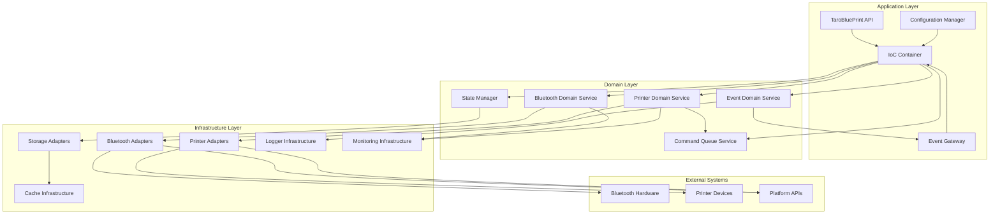
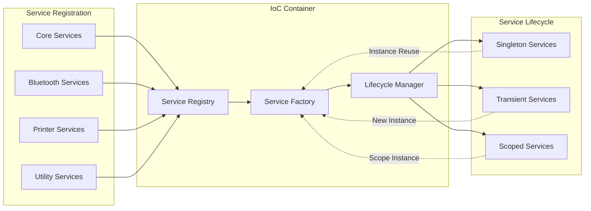
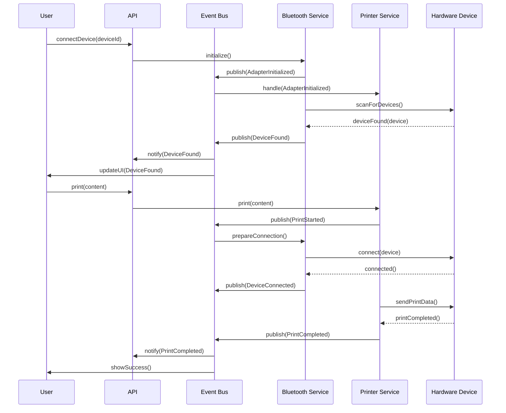
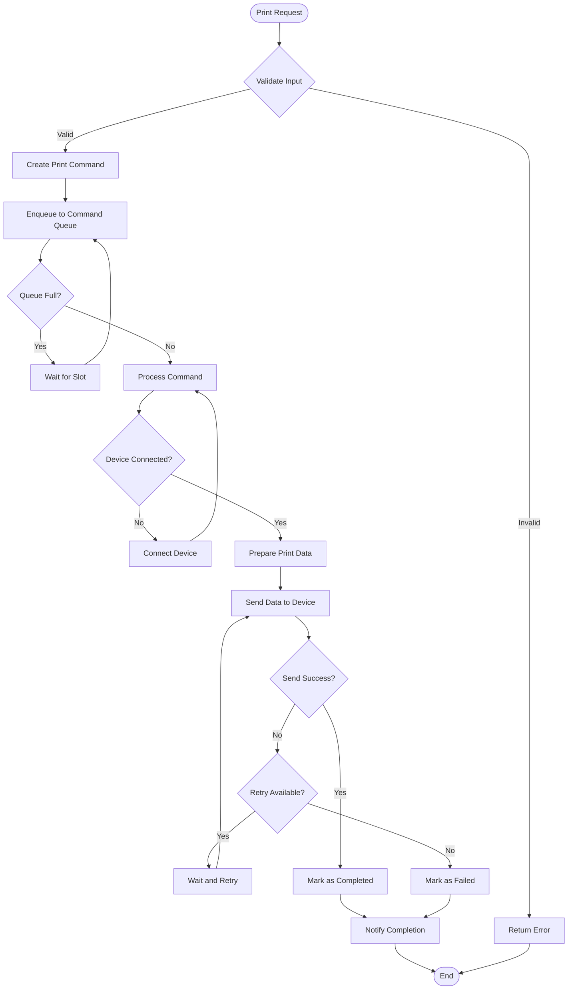
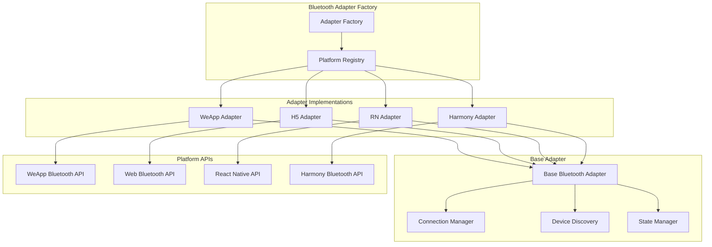
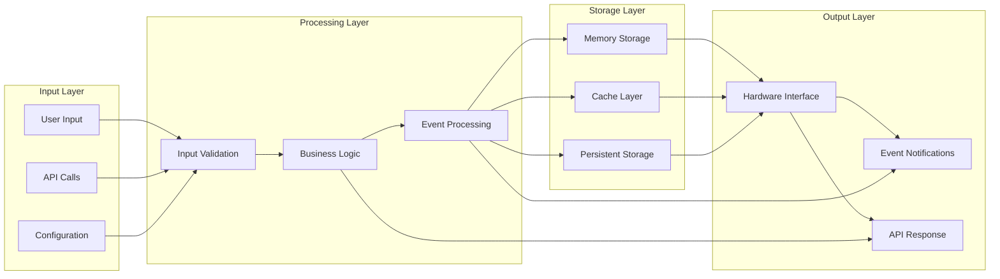
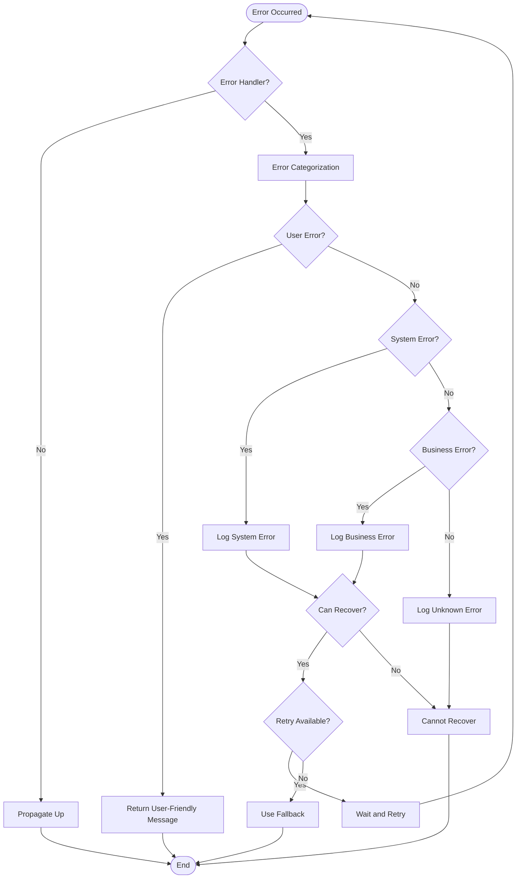
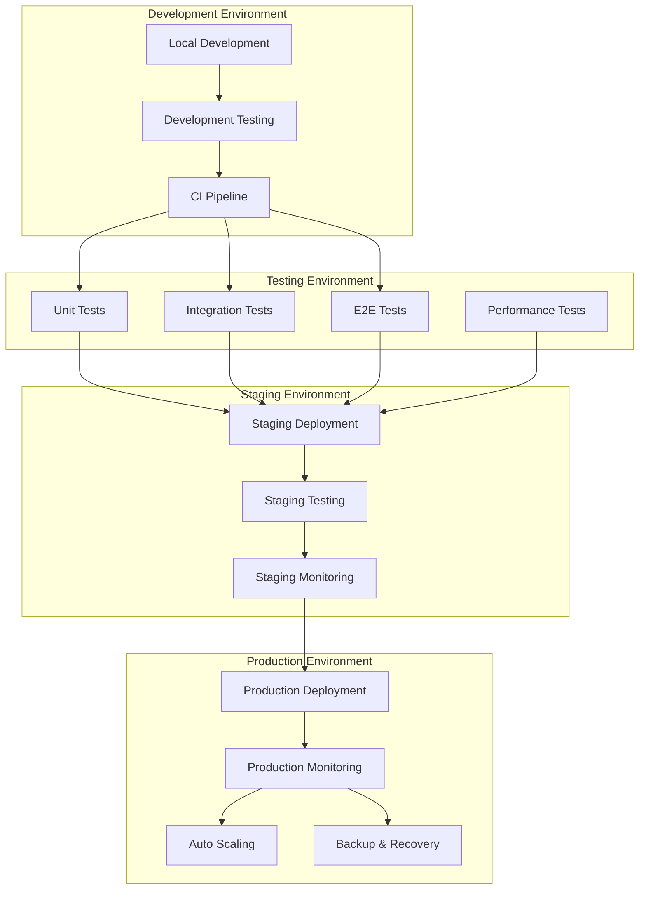
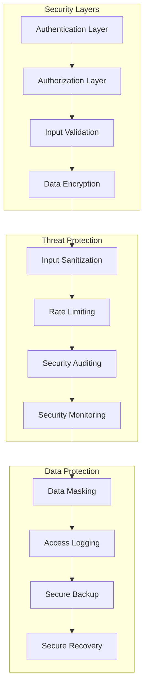

# 架构图集

本文档包含Taro蓝牙打印库重构后的各种架构图，使用Mermaid语法编写，可以在支持Mermaid的工具中渲染。

## 1. 整体系统架构图

## 2. 依赖注入容器架构图

## 3. 事件驱动架构图

## 4. 命令处理流程图

## 5. 蓝牙适配器架构图

## 6. 数据流架构图

## 7. 错误处理架构图

## 8. 部署架构图

## 9. 安全架构图

## 使用说明

这些架构图可以通过以下方式查看和使用：

1. **GitHub Pages**: 直接在GitHub仓库中查看，GitHub原生支持Mermaid
2. **本地工具**: 使用VS Code + Mermaid插件或其他Mermaid渲染工具
3. **在线工具**: 使用Mermaid Live Editor等在线工具
4. **文档生成**: 集成到VitePress或其他文档系统中

这些图表为开发团队提供了清晰的视觉化架构指导，有助于理解系统结构和组件关系。