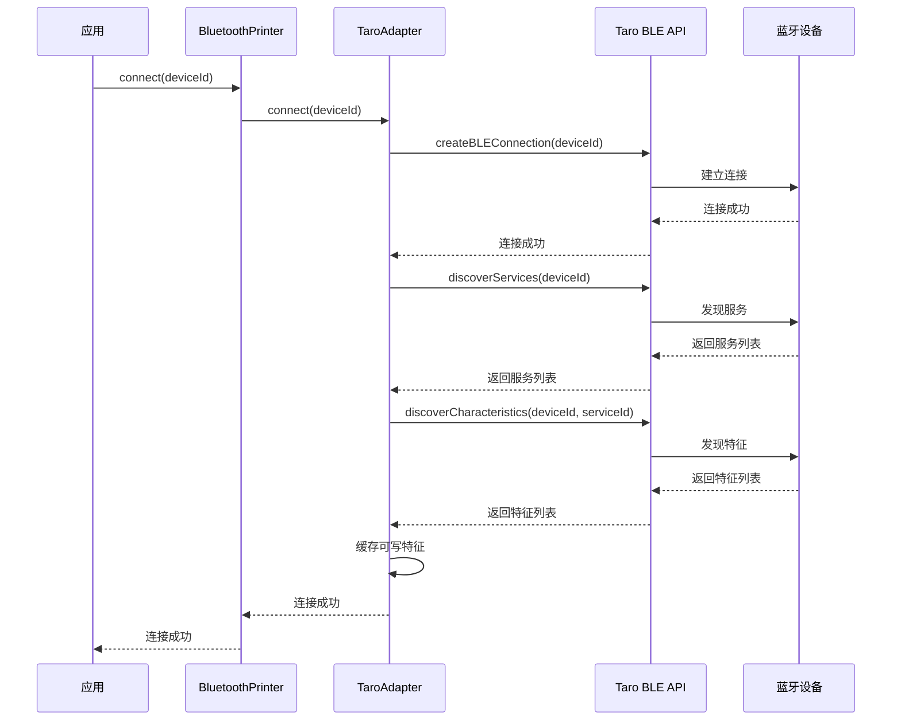
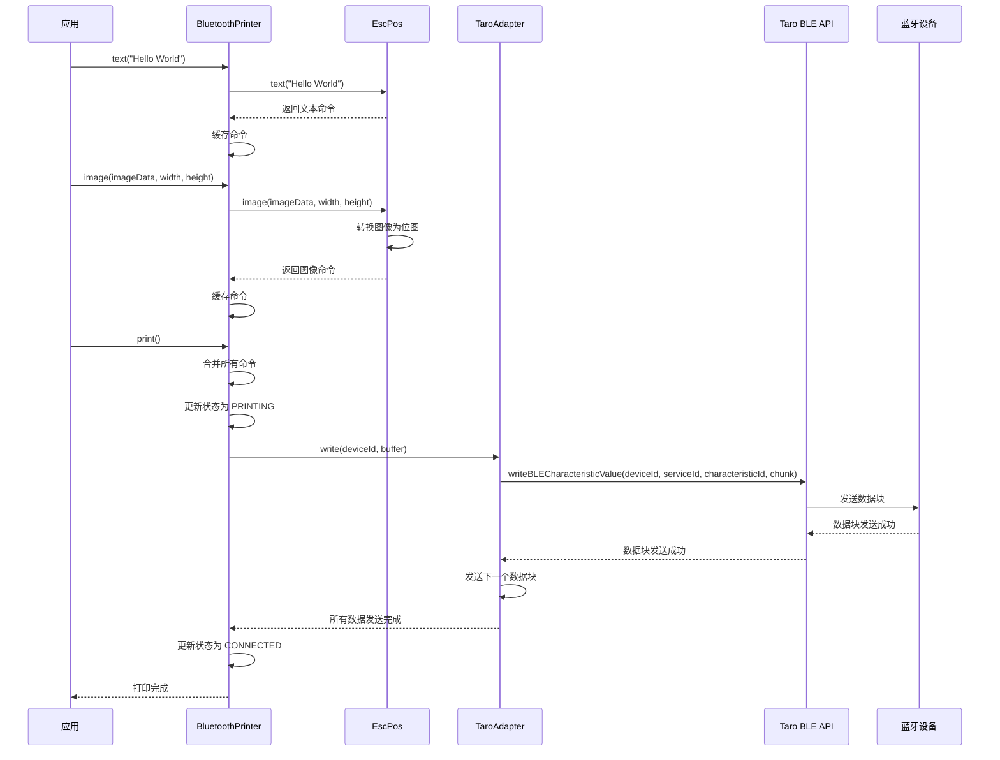

# Taro Bluetooth Print 项目架构文档

## 1. 项目概述

Taro Bluetooth Print 是一个轻量级、高性能的蓝牙打印库，专为 Taro 框架设计，用于连接和控制蓝牙热敏打印机。该库提供了简洁易用的 API，支持文本、图像、二维码等多种打印内容，并具有良好的扩展性和可维护性。

## 2. 系统架构

### 2.1 分层设计

项目采用分层架构设计，主要分为以下几层：

| 层级 | 职责 | 主要模块 |
|------|------|----------|
| 应用层 | 提供对外 API，处理用户请求 | `BluetoothPrinter` |
| 适配器层 | 处理蓝牙设备通信，适配不同平台 | `TaroAdapter` |
| 驱动层 | 生成设备特定的打印命令 | `EscPos` |
| 工具层 | 提供通用工具函数 | `Encoding`, `ImageProcessing`, `Logger` |
| 核心层 | 处理事件、状态管理等核心功能 | `EventEmitter` |
| 错误处理层 | 统一错误类型和处理机制 | `BluetoothPrintError`, `ErrorCode` |

### 2.2 模块关系

```
┌───────────────────────────────────────────────────────────┐
│                     应用层                                 │
│                                                           │
│                   BluetoothPrinter                        │
│                                                           │
└───────────┬───────────────────────────────────────────────┘
            │
            ├────────────────────────────────┐
            │                                │
┌───────────▼───────────┐      ┌────────────▼──────────┐
│     适配器层           │      │        驱动层          │
│                       │      │                       │
│     TaroAdapter       │      │        EscPos          │
│                       │      │                       │
└───────────┬───────────┘      └────────────┬──────────┘
            │                                │
            └────────────────────────────────┼───────────────────────┐
                                             │                       │
┌────────────────────────────────────────────▼─────────┐  ┌──────────▼──────────┐
│                    核心层                              │  │        工具层        │
│                                                       │  │                      │
│                    EventEmitter                       │  │ Encoding, ImageProcessing, Logger │
│                                                       │  │                      │
└────────────────────────────────────────────┬─────────┘  └──────────┬──────────┘
                                             │                       │
                                             └───────────────────────┼───────────────────────┐
                                                                     │                       │
┌────────────────────────────────────────────────────────────────────▼─────────┐  ┌──────────▼──────────┐
│                                 错误处理层                                     │  │        类型定义       │
│                                                                               │  │                      │
│                        BluetoothPrintError, ErrorCode                         │  │        types.ts       │
│                                                                               │  │                      │
└───────────────────────────────────────────────────────────────────────────────┘  └──────────────────────┘
```

## 3. 核心模块说明

### 3.1 BluetoothPrinter

`BluetoothPrinter` 是库的主要入口类，提供了简洁易用的 API 用于连接设备、发送打印命令和管理打印任务。它负责协调适配器和驱动层，处理打印队列和状态管理。

主要功能：
- 设备连接和断开
- 打印命令构建（文本、图像、二维码等）
- 打印任务管理（暂停、恢复、取消）
- 事件发射和处理

### 3.2 TaroAdapter

`TaroAdapter` 实现了 `IPrinterAdapter` 接口，负责处理与 Taro 框架的蓝牙 API 交互，包括设备连接、数据传输和状态监听。

主要功能：
- 蓝牙设备连接和断开
- 服务和特征发现
- 数据分块传输和重试机制
- 连接状态监听

### 3.3 EscPos

`EscPos` 实现了 `IPrinterDriver` 接口，负责将高级打印命令转换为 ESC/POS 指令集，这是大多数热敏打印机支持的标准命令集。

主要功能：
- 初始化打印机
- 生成文本打印命令
- 生成图像打印命令
- 生成二维码打印命令
- 生成纸张控制命令

### 3.4 EventEmitter

`EventEmitter` 是一个类型安全的事件发射器，用于在不同模块之间传递事件和状态变化。

主要功能：
- 事件订阅和发布
- 事件处理函数管理
- 类型安全的事件定义

### 3.5 工具模块

- **Encoding**: 处理文本编码转换
- **ImageProcessing**: 将图像转换为打印机兼容的位图格式
- **Logger**: 提供日志记录功能，支持不同日志级别

## 4. 核心工作流程

### 4.1 设备连接流程



### 4.2 打印流程



## 5. 扩展机制

### 5.1 自定义适配器

开发者可以通过实现 `IPrinterAdapter` 接口来支持其他平台或蓝牙通信方式：

```typescript
class CustomAdapter implements IPrinterAdapter {
  async connect(deviceId: string): Promise<void> {
    // 自定义连接逻辑
  }
  
  async disconnect(deviceId: string): Promise<void> {
    // 自定义断开逻辑
  }
  
  async write(deviceId: string, buffer: ArrayBuffer, options?: IAdapterOptions): Promise<void> {
    // 自定义数据传输逻辑
  }
}
```

### 5.2 自定义驱动

开发者可以通过实现 `IPrinterDriver` 接口来支持其他打印机指令集：

```typescript
class CustomDriver implements IPrinterDriver {
  init(): Uint8Array[] {
    // 自定义初始化命令
  }
  
  text(content: string, encoding?: string): Uint8Array[] {
    // 自定义文本打印命令
  }
  
  // 其他方法实现
}
```

## 6. 配置管理

项目使用集中式配置管理，通过 `PrinterConfig` 类处理配置选项，支持默认配置和自定义配置合并。

主要配置项包括：
- 适配器配置（分块大小、延迟、重试次数）
- 驱动配置（默认编码等）
- 日志配置（日志级别等）

## 7. 错误处理

项目使用统一的错误处理机制，通过 `BluetoothPrintError` 类封装所有错误，并使用 `ErrorCode` 枚举定义错误类型，便于开发者识别和处理不同类型的错误。

## 8. 性能优化

- **数据分块传输**：将大文件分成小块传输，避免蓝牙通信超时
- **重试机制**：在数据传输失败时自动重试，提高可靠性
- **事件驱动**：使用事件驱动模式，减少轮询和阻塞
- **延迟加载**：按需加载模块，减少初始加载时间
- **高效的图像处理**：使用 Floyd-Steinberg 抖动算法，提高图像打印质量

## 9. 测试策略

项目采用单元测试和集成测试相结合的测试策略：
- 单元测试：测试单个模块的功能，确保模块功能正确
- 集成测试：测试模块之间的交互，确保整个系统功能正常
- 性能测试：测试系统在不同负载下的性能表现

## 10. 部署和发布

项目使用 Vite 构建，支持多种格式的输出（ES、CJS、UMD），便于在不同环境中使用。部署和发布流程如下：

1. 运行 `npm run build` 构建项目
2. 运行 `npm run test` 确保所有测试通过
3. 更新版本号和 CHANGELOG.md
4. 运行 `npm publish` 发布到 npm

## 11. 总结

Taro Bluetooth Print 项目采用了分层架构设计，具有良好的扩展性和可维护性。通过适配器模式和驱动模式，该库可以轻松支持不同平台和打印机型号。同时，项目还提供了详细的文档和示例，便于开发者快速上手和使用。