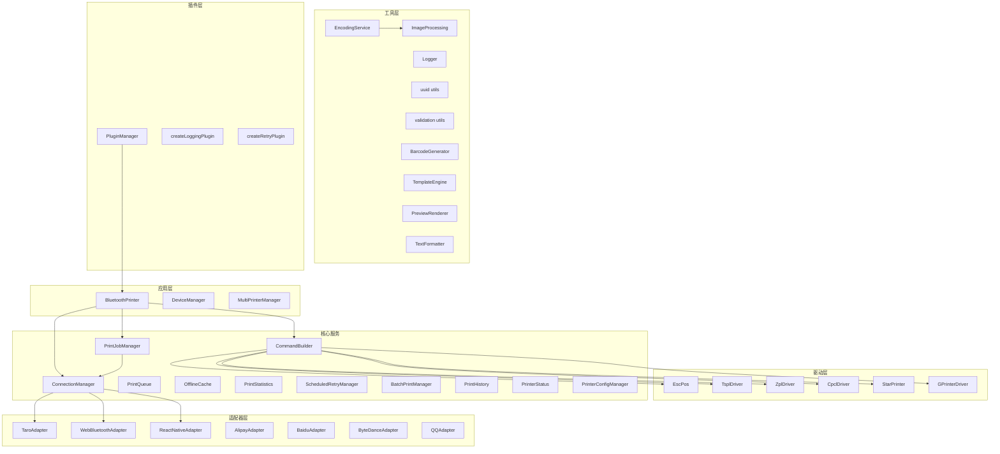
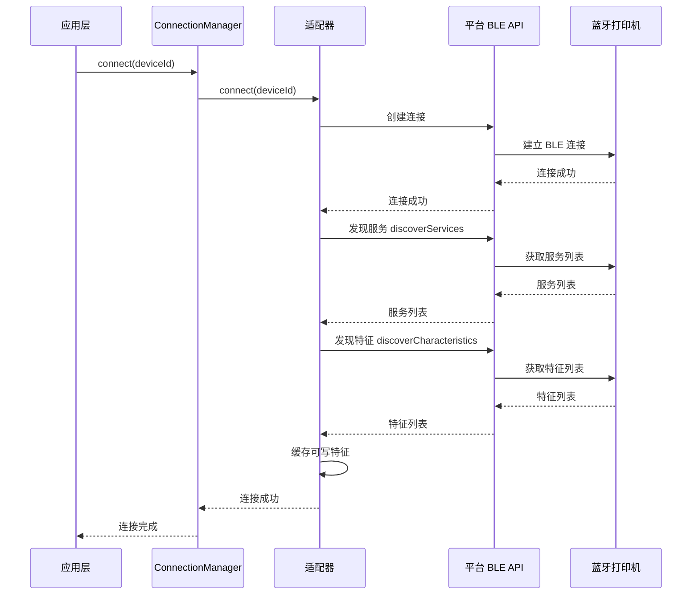
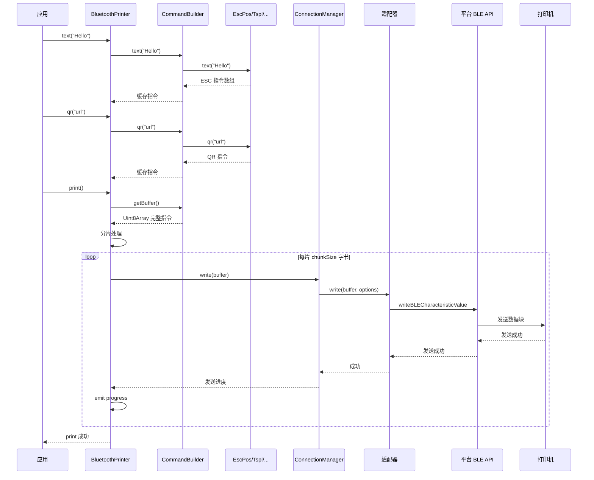
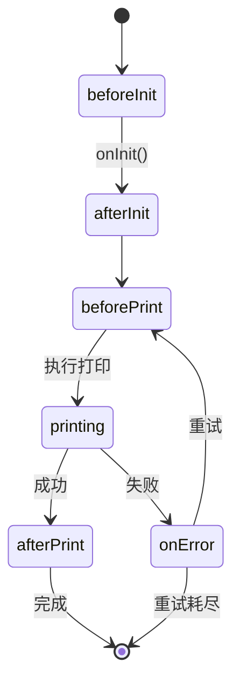

# 项目架构

深入了解 `taro-bluetooth-print` 的整体架构设计、核心模块交互和扩展机制。

## 1. 架构总览

`taro-bluetooth-print` 采用**分层 + 插件化**的架构设计，核心原则是：

1. **适配器层** — 屏蔽不同平台的蓝牙 API 差异
2. **驱动层** — 屏蔽不同打印机指令集的差异
3. **核心服务层** — 提供打印队列、缓存、统计等高级能力
4. **插件层** — 通过 Hook 机制扩展核心功能

```
┌─────────────────────────────────────────────────────────────────┐
│                         应用层                                    │
│                  BluetoothPrinter                                │
│         PrinterEvents / PrinterState                            │
└───────────────────────────┬─────────────────────────────────────┘
                            │
         ┌──────────────────┴──────────────────┐
         │                                       │
┌────────▼────────┐                 ┌────────────▼──────────┐
│      驱动层       │                 │       适配器层         │
│                  │                 │                      │
│  EscPos         │                 │  TaroAdapter         │
│  TsplDriver     │                 │  WebBluetoothAdapter │
│  ZplDriver      │                 │  ReactNativeAdapter  │
│  CpclDriver     │                 │  AlipayAdapter       │
│  StarPrinter    │                 │  BaiduAdapter        │
│  GPrinterDriver │                 │  ByteDanceAdapter    │
└────────┬────────┘                 └──────────┬───────────┘
         │                                       │
         └─────────────────┬─────────────────────┘
                           │
┌───────────────────────────▼──────────────────────────────────────┐
│                        核心服务层                                │
│                                                                  │
│  ConnectionManager  │  PrintJobManager  │  CommandBuilder       │
│  DeviceManager      │  PrintQueue       │  OfflineCache         │
│  MultiPrinterManager│  PrintStatistics  │  PrinterStatus        │
│  PrintHistory       │  ScheduledRetryManager │ BatchPrintManager │
└───────────────────────────┬──────────────────────────────────────┘
                            │
┌───────────────────────────▼──────────────────────────────────────┐
│                         工具层                                   │
│  Encoding  │  ImageProcessing  │  Logger  │  uuid  │  validation │
└─────────────────────────────────────────────────────────────────┘
```

## 2. Mermaid 架构图


```mermaid
graph TB
    subgraph 应用层
        BP[BluetoothPrinter]
        DM[DeviceManager]
        MPM[MultiPrinterManager]
    end

    subgraph 驱动层
        ESC[EscPos]
        TSPL[TsplDriver]
        ZPL[ZplDriver]
        CPCL[CpclDriver]
        STAR[StarPrinter]
        GPRINTER[GPrinterDriver]
    end

    subgraph 适配器层
        TA[TaroAdapter]
        WBA[WebBluetoothAdapter]
        RNA[ReactNativeAdapter]
        AA[AlipayAdapter]
        BDA[BaiduAdapter]
        BTA[ByteDanceAdapter]
        QQA[QQAdapter]
    end

    subgraph 核心服务
        CM[ConnectionManager]
        PJM[PrintJobManager]
        CB[CommandBuilder]
        PQ[PrintQueue]
        OC[OfflineCache]
        PS[PrintStatistics]
        SRM[ScheduledRetryManager]
        BPM[BatchPrintManager]
        PH[PrintHistory]
        PSt[PrinterStatus]
        PCM[PrinterConfigManager]
    end

    subgraph 工具层
        ENC[EncodingService]
        IMG[ImageProcessing]
        LOG[Logger]
        UUID[uuid utils]
        VAL[validation utils]
        BAR[BarcodeGenerator]
        TEMP[TemplateEngine]
        PREV[PreviewRenderer]
        FORM[TextFormatter]
    end

    subgraph 插件层
        PLM[PluginManager]
        LOGP[createLoggingPlugin]
        RTYP[createRetryPlugin]
    end

    BP --> CM
    BP --> PJM
    BP --> CB
    CM --> TA
    CM --> WBA
    CM --> RNA
    PJM --> CM
    CB --> ESC
    CB --> TSPL
    CB --> ZPL
    CB --> CPCL
    CB --> STAR
    CB --> GPRINTER
    PLM --> BP
    ENC --> IMG
```

## 3. 核心数据流

### 3.1 设备连接流程


```mermaid
sequenceDiagram
    participant App as 应用层
    participant CM as ConnectionManager
    participant Adapter as 适配器
    participant BLE as 平台 BLE API
    participant Device as 蓝牙打印机

    App->>CM: connect(deviceId)
    CM->>Adapter: connect(deviceId)
    Adapter->>BLE: 创建连接
    BLE->>Device: 建立 BLE 连接
    Device-->>BLE: 连接成功
    BLE-->>Adapter: 连接成功
    Adapter->>BLE: 发现服务 discoverServices
    BLE->>Device: 获取服务列表
    Device-->>BLE: 服务列表
    BLE-->>Adapter: 服务列表
    Adapter->>BLE: 发现特征 discoverCharacteristics
    BLE->>Device: 获取特征列表
    Device-->>BLE: 特征列表
    BLE-->>Adapter: 特征列表
    Adapter->>Adapter: 缓存可写特征
    Adapter-->>CM: 连接成功
    CM-->>App: 连接完成
```

### 3.2 打印流程


```mermaid
sequenceDiagram
    participant App as 应用
    participant BP as BluetoothPrinter
    participant CB as CommandBuilder
    participant Driver as EscPos/Tspl/...
    participant CM as ConnectionManager
    participant Adapter as 适配器
    participant BLE as 平台 BLE API
    participant Device as 打印机

    App->>BP: text("Hello")
    BP->>CB: text("Hello")
    CB->>Driver: text("Hello")
    Driver-->>CB: ESC 指令数组
    CB-->>BP: 缓存指令
    App->>BP: qr("url")
    BP->>CB: qr("url")
    CB->>Driver: qr("url")
    Driver-->>CB: QR 指令
    CB-->>BP: 缓存指令
    App->>BP: print()
    BP->>CB: getBuffer()
    CB-->>BP: Uint8Array 完整指令
    BP->>BP: 分片处理
    loop 每片 chunkSize 字节
        BP->>CM: write(buffer)
        CM->>Adapter: write(buffer, options)
        Adapter->>BLE: writeBLECharacteristicValue
        BLE->>Device: 发送数据块
        Device-->>BLE: 发送成功
        BLE-->>Adapter: 发送成功
        Adapter-->>CM: 成功
        CM-->>BP: 发送进度
        BP->>BP: emit progress
    end
    BP-->>App: print 成功
```

## 4. 核心模块详解

### 4.1 BluetoothPrinter（主入口）

协调 `ConnectionManager`、`PrintJobManager` 和 `CommandBuilder`，对外暴露链式打印 API：

```typescript
// 内部结构
class BluetoothPrinter {
  private connectionManager: IConnectionManager;
  private printJobManager: IPrintJobManager;
  private commandBuilder: ICommandBuilder;

  // 核心方法
  async connect(deviceId: string): Promise<this>;
  async disconnect(): Promise<void>;
  async print(buffer?: Uint8Array): Promise<void>;

  // 链式 API
  text(content: string, encoding?: string): this;
  qr(content: string, options?: IQrOptions): this;
  feed(lines?: number): this;
  cut(): this;
  // ...

  // 打印控制
  pause(): void;
  resume(): Promise<void>;
  cancel(): void;
  remaining(): number;
}
```

### 4.2 CommandBuilder（指令构建器）

负责将链式 API 调用转换为驱动指令：

```typescript
class CommandBuilder {
  private commands: Uint8Array[] = [];

  text(content: string, encoding?: string): this;
  feed(lines?: number): this;
  image(data: Uint8Array, width: number, height: number): this;
  // ...

  getBuffer(): Uint8Array;
  reset(): void;
}
```

### 4.3 ConnectionManager（连接管理器）

管理蓝牙连接生命周期，提供写入和状态管理：

```typescript
interface IConnectionManager {
  connect(deviceId: string): Promise<void>;
  disconnect(): Promise<void>;
  write(buffer: ArrayBuffer, options?: IAdapterOptions): Promise<void>;
  getState(): PrinterState;
  getDeviceId(): string | null;
}
```

### 4.4 PrintJobManager（打印任务管理器）

管理打印任务的执行、暂停、恢复和取消：

```typescript
interface IPrintJobManager {
  isInProgress(): boolean;
  isPaused(): boolean;
  cancel(): void;
  getProgress(): PrintProgress;
}
```

## 5. 扩展点说明

### 5.1 扩展层次

| 扩展方式 | 适用场景 | 复杂度 |
|---------|---------|--------|
| **配置参数** | 调整分片大小、重试次数等 | ⭐ 简单 |
| **插件系统** | 添加日志、重试、分析等横向功能 | ⭐⭐ 中等 |
| **自定义适配器** | 接入新的蓝牙平台 | ⭐⭐⭐ 较复杂 |
| **自定义驱动** | 支持新的打印机协议 | ⭐⭐⭐ 较复杂 |

### 5.2 插件 Hook 生命周期


```mermaid
stateDiagram-v2
    [*] --> beforeInit
    beforeInit --> afterInit: onInit()
    afterInit --> beforePrint
    beforePrint --> printing: 执行打印
    printing --> afterPrint: 成功
    printing --> onError: 失败
    afterPrint --> [*]: 完成
    onError --> beforePrint: 重试
    onError --> [*]: 重试耗尽
```

### 5.3 扩展示例：接入新平台


```mermaid
graph LR
    A[新平台 BLE API] -->|实现| B[IPrinterAdapter]
    B -->|注入| C[BluetoothPrinter]
    C -->|使用| B
```

## 6. 事件流

```
用户调用 printer.on('progress', handler)
       │
       ▼
EventEmitter.addListener('progress', handler)
       │
       ▼
PrintJobManager 执行打印
       │
       ▼
每次分片发送完成
       │
       ▼
printer.emit('progress', { sent, total })
       │
       ▼
所有 handler 被依次调用
```

## 7. 配置层级

```
默认配置 (DEFAULT_CONFIG)
       │
       ├── PrinterConfigManager (用户保存的配置)
       │        │
       │        └── 优先级: 全局配置 > 打印机配置 > 默认值
       │
       └── 运行时 setOptions()（仅影响当前实例）
```

## 8. 错误处理策略

```
错误发生
   │
   ├── 是插件错误钩子？
   │    ├── 是 → 插件 onError 处理
   │    └── 否 → 进入核心错误处理
   │
   ├── BluetoothPrintError
   │    │
   │    ├── WRITE_FAILED
   │    │    ├── retries < maxRetries?
   │    │    │    ├── 是 → 延迟重试
   │    │    │    └── 否 → 发出 error 事件
   │    │    │
   │    │    └── OfflineCache.autoSync 启用?
   │    │         └── 是 → 缓存任务
   │    │
   │    └── 其他错误 → 发出 error 事件
   │
   └── 普通 Error → 包装为 BluetoothPrintError → 发出
```

## 9. 性能关键路径

| 环节 | 优化手段 |
|------|---------|
| 蓝牙写入 | 分片传输（chunkSize）+ 可配置延迟 |
| 图像转换 | Floyd-Steinberg 抖动（Web Worker 可迁移） |
| 模板渲染 | 预编译模板函数（`engine.compile()`） |
| 批量打印 | `BatchPrintManager` 自动合并小任务 |
| 弱网适应 | `ScheduledRetryManager` 指数退避 |

## 10. 目录结构

```
src/
├── index.ts                    # 主入口，导出所有公开 API
├── types.ts                    # 核心类型定义（PrinterState, IPrinterAdapter 等）
│
├── core/
│   ├── BluetoothPrinter.ts     # 主入口类
│   ├── EventEmitter.ts         # 事件发射器
│   ├── BatchPrintManager.ts    # 批量打印管理
│   ├── CommandBuilder.ts       # 指令构建器
│   ├── ConnectionManager.ts    # 连接管理
│   ├── PrinterStatus.ts        # 状态查询
│   ├── PrintHistory.ts         # 打印历史
│   ├── PrintJobManager.ts      # 打印任务管理
│   ├── PrintStatistics.ts      # 统计服务
│   └── ScheduledRetryManager.ts # 定时重试
│
├── adapters/                   # 平台适配器
│   ├── BaseAdapter.ts          # 基础适配器
│   ├── TaroAdapter.ts          # Taro 框架适配器
│   ├── WebBluetoothAdapter.ts  # Web Bluetooth
│   ├── AlipayAdapter.ts        # 支付宝小程序
│   ├── BaiduAdapter.ts         # 百度小程序
│   ├── ByteDanceAdapter.ts     # 字节跳动小程序
│   ├── QQAdapter.ts            # QQ 小程序
│   ├── ReactNativeAdapter.ts   # React Native
│   └── AdapterFactory.ts       # 适配器工厂
│
├── drivers/                    # 打印机驱动
│   ├── EscPos.ts               # ESC/POS 热敏票据
│   ├── TsplDriver.ts           # TSPL 标签机
│   ├── ZplDriver.ts            # ZPL Zebra 工业机
│   ├── CpclDriver.ts           # CPCL HP/霍尼韦尔
│   ├── StarPrinter.ts           # STAR TSP 系列
│   └── GPrinterDriver.ts       # 佳博 GP 系列
│
├── services/
│   ├── interfaces/             # 服务接口定义
│   └── *.ts                    # 核心服务实现
│
├── plugins/
│   ├── PluginManager.ts         # 插件管理器
│   └── types.ts                # 插件类型定义
│
├── template/                    # 模板引擎
│   └── TemplateEngine.ts        # 支持 loop/condition/border/table
│
├── barcode/
│   └── BarcodeGenerator.ts     # 条码生成器（含 QR/PDF417）
│
├── cache/
│   └── OfflineCache.ts         # 离线缓存
│
├── queue/
│   └── PrintQueue.ts           # 打印队列
│
├── formatter/
│   └── TextFormatter.ts        # 文本格式化
│
├── preview/
│   └── PreviewRenderer.ts      # 打印预览
│
├── encoding/
│   └── EncodingService.ts      # 编码服务
│
├── device/
│   ├── DeviceManager.ts        # 设备扫描管理
│   └── MultiPrinterManager.ts  # 多打印机管理
│
├── config/
│   ├── PrinterConfig.ts        # 配置定义
│   └── PrinterConfigManager.ts # 配置管理
│
├── errors/
│   └── BluetoothError.ts       # 错误类型
│
└── utils/
    ├── encoding.ts             # 编码工具
    ├── image.ts                # 图像工具
    ├── logger.ts               # 日志工具
    ├── platform.ts             # 平台检测
    ├── uuid.ts                 # UUID 工具
    └── validation.ts           # 验证工具
```
