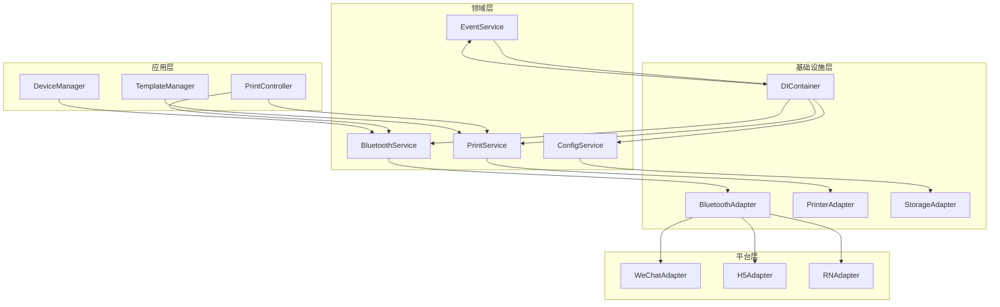
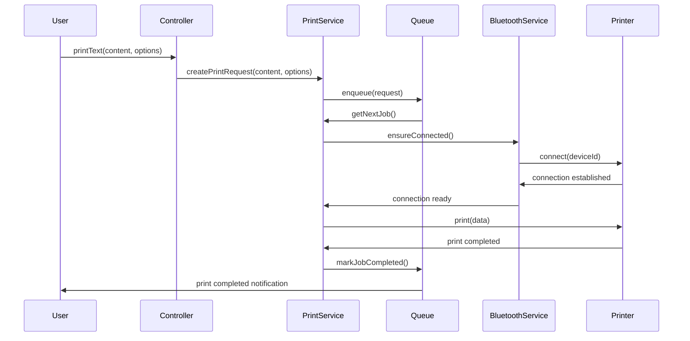
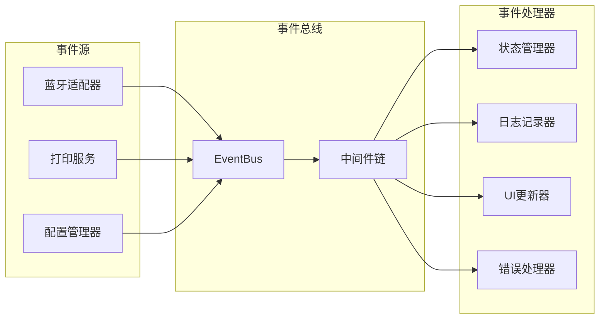

# Taro Bluetooth Print v2.0 架构文档

## 概述

Taro Bluetooth Print v2.0 是一个完全重构的版本，采用现代化的软件架构设计理念，包括依赖注入、事件驱动架构、分层设计等，旨在提供更好的可维护性、可扩展性和性能表现。

## 📋 目录

- [设计理念](#设计理念)
- [架构概览](#架构概览)
- [核心架构](#核心架构)
- [技术栈](#技术栈)
- [模块设计](#模块设计)
- [数据流](#数据流)
- [生命周期管理](#生命周期管理)
- [扩展机制](#扩展机制)
- [性能考虑](#性能考虑)
- [安全架构](#安全架构)

## 🎯 设计理念

### 1. 分层架构 (Layered Architecture)

采用经典的三层架构模式，确保各层职责清晰，依赖关系明确：

```
┌─────────────────────────────────────┐
│           应用层 (Application)        │  ← 业务逻辑、用例实现
├─────────────────────────────────────┤
│           领域层 (Domain)            │  ← 核心业务模型、规则
├─────────────────────────────────────┤
│        基础设施层 (Infrastructure)    │  ← 外部接口、技术实现
└─────────────────────────────────────┘
```

**原则：**
- 依赖方向：应用层 → 领域层 ← 基础设施层
- 每层只与相邻层交互，避免跨层依赖
- 业务逻辑集中在领域层，不依赖外部技术

### 2. 依赖注入 (Dependency Injection)

使用 IoC 容器管理对象生命周期和依赖关系：

```typescript
// 依赖关系声明
interface ServiceDependencies {
  bluetoothAdapter: IBluetoothAdapter;
  eventBus: IEventBus;
  logger: ILogger;
  configManager: IConfigManager;
}

// 容器配置
container
  .registerSingleton<IBluetoothAdapter>('bluetoothAdapter', WeChatBluetoothAdapter)
  .registerSingleton<IEventBus>('eventBus', EventBus)
  .registerSingleton<ILogger>('logger', ConsoleLogger);
```

**优势：**
- 松耦合：组件间通过接口交互
- 可测试：便于注入 Mock 对象
- 可配置：支持不同环境的实现切换

### 3. 事件驱动架构 (Event-Driven Architecture)

基于发布订阅模式的事件系统实现异步通信：

```typescript
// 事件定义
interface BluetoothEvents {
  'device:found': IBluetoothDevice;
  'connection:established': { deviceId: string };
  'connection:lost': { deviceId: string; error?: Error };
}

// 事件发布
eventBus.publish('device:found', device);

// 事件订阅
eventBus.subscribe('connection:lost', ({ deviceId, error }) => {
  logger.warn(`Device ${deviceId} disconnected`, { error });
});
```

**特点：**
- 解耦：发布者和订阅者互不依赖
- 异步：支持非阻塞的事件处理
- 可扩展：易于添加新的事件类型和处理器

### 4. 模块化设计 (Modular Design)

每个功能模块独立封装，支持按需加载：

```typescript
// 模块接口
interface IModule {
  name: string;
  version: string;
  dependencies: string[];
  initialize(container: DIContainer): Promise<void>;
  dispose(): Promise<void>;
}

// 模块实现
class BluetoothModule implements IModule {
  name = 'bluetooth';
  version = '1.0.0';
  dependencies = ['logging', 'events'];

  async initialize(container: DIContainer): Promise<void> {
    // 注册蓝牙相关服务
    container.registerSingleton<IBluetoothAdapter>(
      'bluetoothAdapter',
      () => new WeChatBluetoothAdapter()
    );
  }
}
```

## 🏗️ 架构概览

### 整体架构图

```
┌─────────────────────────────────────────────────────────────┐
│                    应用程序 (Application)                     │
├─────────────────────────────────────────────────────────────┤
│  ┌─────────────────┐  ┌─────────────────┐  ┌─────────────────┐ │
│  │   打印控制器     │  │   设备管理器     │  │   模板管理器     │ │
│  │ PrintController │  │DeviceManager   │  │TemplateManager  │ │
│  └─────────────────┘  └─────────────────┘  └─────────────────┘ │
├─────────────────────────────────────────────────────────────┤
│                       事件总线 (EventBus)                     │
├─────────────────────────────────────────────────────────────┤
│  ┌─────────────────┐  ┌─────────────────┐  ┌─────────────────┐ │
│  │   蓝牙服务       │  │   打印服务       │  │   配置服务       │ │
│  │ BluetoothService│  │  PrintService   │  │ ConfigService   │ │
│  └─────────────────┘  └─────────────────┘  └─────────────────┘ │
├─────────────────────────────────────────────────────────────┤
│  ┌─────────────────┐  ┌─────────────────┐  ┌─────────────────┐ │
│  │   蓝牙适配器     │  │   打印机适配器   │  │   存储适配器     │ │
│  │BluetoothAdapter │  │ PrinterAdapter  │  │ StorageAdapter  │ │
│  └─────────────────┘  └─────────────────┘  └─────────────────┘ │
├─────────────────────────────────────────────────────────────┤
│                     平台层 (Platform)                       │
│  ┌─────────────────┐  ┌─────────────────┐  ┌─────────────────┐ │
│  │   微信小程序     │  │      H5         │  │  React Native   │ │
│  │   WeChat App    │  │     Web         │  │      RN         │ │
│  └─────────────────┘  └─────────────────┘  └─────────────────┘ │
└─────────────────────────────────────────────────────────────┘
```

### 核心组件关系



## 🔧 核心架构

### 1. 依赖注入容器

```typescript
class DIContainer {
  private services: Map<string, ServiceDefinition> = new Map();
  private instances: Map<string, any> = new Map();
  private singletons: Set<string> = new Set();

  // 注册服务
  register<T>(token: string, factory: ServiceFactory<T>, options?: ServiceOptions): void {
    this.services.set(token, {
      token,
      factory,
      options: {
        lifetime: ServiceLifetime.Transient,
        ...options
      }
    });
  }

  // 注册单例
  registerSingleton<T>(token: string, factory: ServiceFactory<T>): void {
    this.register(token, factory, { lifetime: ServiceLifetime.Singleton });
    this.singletons.add(token);
  }

  // 解析服务
  resolve<T>(token: string): T {
    const definition = this.services.get(token);
    if (!definition) {
      throw new Error(`Service ${token} not registered`);
    }

    // 单例模式
    if (definition.options?.lifetime === ServiceLifetime.Singleton) {
      if (!this.instances.has(token)) {
        const instance = this.createInstance(definition);
        this.instances.set(token, instance);
      }
      return this.instances.get(token);
    }

    // 瞬态模式
    return this.createInstance(definition);
  }

  private createInstance<T>(definition: ServiceDefinition): T {
    const dependencies = this.resolveDependencies(definition);
    return definition.factory(dependencies);
  }

  private resolveDependencies(definition: ServiceDefinition): any {
    const dependencies: any = {};

    if (definition.options?.dependencies) {
      for (const dep of definition.options.dependencies) {
        dependencies[dep] = this.resolve(dep);
      }
    }

    return dependencies;
  }
}
```

### 2. 事件总线系统

```typescript
class EventBus implements IEventBus {
  private listeners: Map<string, EventListener[]> = new Map();
  private history: EventRecord[] = [];
  private middlewares: EventMiddleware[] = [];
  private maxHistorySize: number = 1000;

  // 发布事件
  publish<T>(eventType: string, data: T): void {
    const event: EventRecord = {
      id: this.generateId(),
      type: eventType,
      data,
      timestamp: Date.now()
    };

    // 应用中间件
    this.applyMiddlewares(event);

    // 保存历史记录
    this.saveToHistory(event);

    // 通知监听器
    this.notifyListeners(eventType, data);
  }

  // 订阅事件
  subscribe<T>(eventType: string, handler: EventHandler<T>): UnsubscribeFunction {
    if (!this.listeners.has(eventType)) {
      this.listeners.set(eventType, []);
    }

    const listeners = this.listeners.get(eventType)!;
    const wrappedHandler: EventListener = {
      handler,
      id: this.generateId()
    };

    listeners.push(wrappedHandler);

    // 返回取消订阅函数
    return () => {
      const index = listeners.indexOf(wrappedHandler);
      if (index > -1) {
        listeners.splice(index, 1);
      }
    };
  }

  // 一次性订阅
  once<T>(eventType: string, handler: EventHandler<T>): void {
    const unsubscribe = this.subscribe(eventType, (data: T) => {
      handler(data);
      unsubscribe();
    });
  }

  // 使用中间件
  use(middleware: EventMiddleware): void {
    this.middlewares.push(middleware);
  }

  private applyMiddlewares(event: EventRecord): void {
    for (const middleware of this.middlewares) {
      try {
        middleware(event);
      } catch (error) {
        console.error('Event middleware error:', error);
      }
    }
  }

  private notifyListeners<T>(eventType: string, data: T): void {
    const listeners = this.listeners.get(eventType) ?? [];

    // 异步通知，避免阻塞
    setTimeout(() => {
      for (const listener of listeners) {
        try {
          (listener.handler as EventHandler<T>)(data);
        } catch (error) {
          console.error(`Error in event handler for ${eventType}:`, error);
        }
      }
    }, 0);
  }

  private saveToHistory(event: EventRecord): void {
    this.history.unshift(event);

    if (this.history.length > this.maxHistorySize) {
      this.history.pop();
    }
  }

  private generateId(): string {
    return Math.random().toString(36).substr(2, 9);
  }
}
```

### 3. 配置管理系统

```typescript
class ConfigManager implements IConfigManager {
  private config: Map<string, any> = new Map();
  private watchers: Map<string, ConfigWatcher[]> = new Map();
  private environment: Environment;

  constructor(initialConfig?: any, environment: Environment = 'development') {
    this.environment = environment;
    if (initialConfig) {
      this.loadConfig(initialConfig);
    }
  }

  // 获取配置值
  get<T>(key: string, defaultValue?: T): T {
    const value = this.config.get(key);
    return value !== undefined ? value : defaultValue;
  }

  // 设置配置值
  set<T>(key: string, value: T): void {
    const oldValue = this.config.get(key);
    this.config.set(key, value);

    // 通知观察者
    this.notifyWatchers(key, value, oldValue);
  }

  // 检查配置是否存在
  has(key: string): boolean {
    return this.config.has(key);
  }

  // 删除配置
  delete(key: string): void {
    const oldValue = this.config.get(key);
    this.config.delete(key);
    this.notifyWatchers(key, undefined, oldValue);
  }

  // 监听配置变化
  watch(key: string, callback: ConfigChangeCallback): UnsubscribeFunction {
    if (!this.watchers.has(key)) {
      this.watchers.set(key, []);
    }

    const watchers = this.watchers.get(key)!;
    const watcher: ConfigWatcher = {
      id: this.generateId(),
      callback
    };

    watchers.push(watcher);

    return () => {
      const index = watchers.indexOf(watcher);
      if (index > -1) {
        watchers.splice(index, 1);
      }
    };
  }

  // 获取环境
  getEnvironment(): Environment {
    return this.environment;
  }

  // 加载配置
  private loadConfig(config: any, prefix = ''): void {
    for (const [key, value] of Object.entries(config)) {
      const fullKey = prefix ? `${prefix}.${key}` : key;

      if (typeof value === 'object' && value !== null && !Array.isArray(value)) {
        this.loadConfig(value, fullKey);
      } else {
        this.config.set(fullKey, value);
      }
    }
  }

  private notifyWatchers(key: string, newValue: any, oldValue: any): void {
    const watchers = this.watchers.get(key) ?? [];

    setTimeout(() => {
      for (const watcher of watchers) {
        try {
          watcher.callback(newValue, oldValue, key);
        } catch (error) {
          console.error(`Config watcher error for ${key}:`, error);
        }
      }
    }, 0);
  }

  private generateId(): string {
    return Math.random().toString(36).substr(2, 9);
  }
}
```

## 🛠️ 技术栈

### 核心技术

| 技术 | 版本 | 用途 |
|------|------|------|
| TypeScript | ^5.0 | 类型安全、开发体验 |
| Taro | ^3.6.0 | 跨平台开发框架 |
| Jest | ^29.0 | 单元测试框架 |
| ESLint | ^8.0 | 代码质量检查 |
| Prettier | ^3.0 | 代码格式化 |

### 架构模式

| 模式 | 应用场景 | 优势 |
|------|----------|------|
| 依赖注入 | 服务管理、测试支持 | 松耦合、可测试 |
| 事件驱动 | 异步通信、模块解耦 | 可扩展、异步处理 |
| 工厂模式 | 对象创建、平台适配 | 封装创建逻辑 |
| 策略模式 | 平台适配、算法选择 | 算法可替换 |
| 观察者模式 | 事件监听、状态变化 | 松耦合通信 |
| 单例模式 | 配置管理、服务实例 | 全局唯一、资源共享 |

## 📦 模块设计

### 1. 蓝牙模块 (Bluetooth Module)

```typescript
interface BluetoothModule {
  // 核心服务
  BluetoothService: IBluetoothService;
  BluetoothAdapter: IBluetoothAdapter;
  DeviceScanner: IDeviceScanner;
  ConnectionManager: IConnectionManager;

  // 事件类型
  events: {
    'device:found': IBluetoothDevice;
    'device:connected': IBluetoothDevice;
    'device:disconnected': IBluetoothDevice;
    'scan:started': void;
    'scan:completed': IBluetoothDevice[];
    'connection:failed': { deviceId: string; error: Error };
  };

  // 配置项
  config: {
    scanTimeout: number;
    connectionTimeout: number;
    autoReconnect: boolean;
    maxReconnectAttempts: number;
    deviceFilter?: (device: IBluetoothDevice) => boolean;
  };
}
```

**职责：**
- 蓝牙设备扫描和发现
- 设备连接和断开管理
- 数据传输和通信
- 连接状态监控

### 2. 打印模块 (Print Module)

```typescript
interface PrintModule {
  // 核心服务
  PrintService: IPrintService;
  PrintQueue: IPrintQueue;
  PrintJobManager: IPrintJobManager;
  TemplateEngine: ITemplateEngine;

  // 事件类型
  events: {
    'job:created': IPrintJob;
    'job:started': IPrintJob;
    'job:completed': IPrintJob;
    'job:failed': { job: IPrintJob; error: Error };
    'queue:status': QueueStatus;
  };

  // 配置项
  config: {
    defaultDensity: number;
    defaultPaperWidth: number;
    maxQueueSize: number;
    concurrency: number;
    retryAttempts: number;
  };
}
```

**职责：**
- 打印任务创建和管理
- 打印队列调度
- 模板渲染和处理
- 打印状态跟踪

### 3. 配置模块 (Config Module)

```typescript
interface ConfigModule {
  // 核心服务
  ConfigManager: IConfigManager;
  EnvironmentDetector: IEnvironmentDetector;
  ConfigValidator: IConfigValidator;

  // 配置结构
  config: {
    bluetooth: BluetoothConfig;
    printer: PrinterConfig;
    queue: QueueConfig;
    logging: LoggingConfig;
    events: EventConfig;
  };

  // 事件类型
  events: {
    'config:changed': { key: string; value: any; oldValue: any };
    'environment:changed': Environment;
    'config:validated': ValidationResult;
  };
}
```

**职责：**
- 配置加载和管理
- 环境检测和适配
- 配置验证和校验
- 配置变更通知

## 🔄 数据流

### 1. 打印流程数据流



### 2. 事件传播流程



## 🔄 生命周期管理

### 1. 应用生命周期

```typescript
enum ApplicationLifecycle {
  Initializing = 'initializing',
  Ready = 'ready',
  Connecting = 'connecting',
  Connected = 'connected',
  Printing = 'printing',
  Error = 'error',
  Disconnected = 'disconnected',
  Disposed = 'disposed'
}

class LifecycleManager {
  private currentState: ApplicationLifecycle = ApplicationLifecycle.Initializing;
  private lifecycleHooks: Map<ApplicationLifecycle, LifecycleHook[]> = new Map();

  async transitionTo(state: ApplicationLifecycle, context?: any): Promise<void> {
    const previousState = this.currentState;

    // 执行退出钩子
    await this.executeExitHooks(previousState);

    // 更新状态
    this.currentState = state;

    // 执行进入钩子
    await this.executeEntryHooks(state, context);

    // 发布状态变化事件
    this.eventBus.publish('lifecycle:changed', {
      from: previousState,
      to: state,
      context
    });
  }

  addHook(state: ApplicationLifecycle, hook: LifecycleHook): void {
    if (!this.lifecycleHooks.has(state)) {
      this.lifecycleHooks.set(state, []);
    }

    this.lifecycleHooks.get(state)!.push(hook);
  }

  private async executeExitHooks(state: ApplicationLifecycle): Promise<void> {
    const hooks = this.lifecycleHooks.get(state) ?? [];

    for (const hook of hooks) {
      if (hook.onExit) {
        await hook.onExit();
      }
    }
  }

  private async executeEntryHooks(state: ApplicationLifecycle, context?: any): Promise<void> {
    const hooks = this.lifecycleHooks.get(state) ?? [];

    for (const hook of hooks) {
      if (hook.onEntry) {
        await hook.onEntry(context);
      }
    }
  }
}
```

### 2. 服务生命周期

```typescript
interface ServiceLifecycle {
  initialize(): Promise<void>;
  start(): Promise<void>;
  stop(): Promise<void>;
  dispose(): Promise<void>;
}

abstract class BaseService implements ServiceLifecycle {
  protected isInitialized: boolean = false;
  protected isStarted: boolean = false;
  protected isDisposed: boolean = false;

  async initialize(): Promise<void> {
    if (this.isInitialized) return;

    await this.onInitialize();
    this.isInitialized = true;
  }

  async start(): Promise<void> {
    if (!this.isInitialized) {
      await this.initialize();
    }

    if (this.isStarted) return;

    await this.onStart();
    this.isStarted = true;
  }

  async stop(): Promise<void> {
    if (!this.isStarted) return;

    await this.onStop();
    this.isStarted = false;
  }

  async dispose(): Promise<void> {
    if (this.isDisposed) return;

    await this.stop();
    await this.onDispose();
    this.isDisposed = true;
  }

  protected abstract onInitialize(): Promise<void>;
  protected abstract onStart(): Promise<void>;
  protected abstract onStop(): Promise<void>;
  protected abstract onDispose(): Promise<void>;
}
```

## 🔧 扩展机制

### 1. 插件系统

```typescript
interface Plugin {
  name: string;
  version: string;
  dependencies?: string[];
  install(app: IApplication): Promise<void>;
  uninstall(app: IApplication): Promise<void>;
}

class PluginManager {
  private plugins: Map<string, Plugin> = new Map();
  private installedPlugins: Set<string> = new Set();

  async installPlugin(plugin: Plugin): Promise<void> {
    // 检查依赖
    await this.checkDependencies(plugin);

    // 安装插件
    await plugin.install(this.application);

    // 记录安装状态
    this.plugins.set(plugin.name, plugin);
    this.installedPlugins.add(plugin.name);

    // 发布安装事件
    this.eventBus.publish('plugin:installed', { plugin });
  }

  async uninstallPlugin(pluginName: string): Promise<void> {
    const plugin = this.plugins.get(pluginName);
    if (!plugin) {
      throw new Error(`Plugin ${pluginName} not found`);
    }

    // 卸载插件
    await plugin.uninstall(this.application);

    // 更新状态
    this.installedPlugins.delete(pluginName);

    // 发布卸载事件
    this.eventBus.publish('plugin:uninstalled', { plugin });
  }

  private async checkDependencies(plugin: Plugin): Promise<void> {
    if (!plugin.dependencies) return;

    for (const dep of plugin.dependencies) {
      if (!this.installedPlugins.has(dep)) {
        throw new Error(`Missing dependency: ${dep}`);
      }
    }
  }
}
```

### 2. 适配器扩展

```typescript
interface PlatformAdapter {
  name: string;
  version: string;
  capabilities: PlatformCapability[];
  initialize(): Promise<void>;
  isSupported(): boolean;
  createBluetoothAdapter(): IBluetoothAdapter;
  createStorageAdapter(): IStorageAdapter;
  createNetworkAdapter(): INetworkAdapter;
}

class AdapterRegistry {
  private adapters: Map<string, PlatformAdapter> = new Map();
  private currentAdapter: PlatformAdapter | null = null;

  registerAdapter(adapter: PlatformAdapter): void {
    this.adapters.set(adapter.name, adapter);
  }

  async initializeAdapter(adapterName: string): Promise<PlatformAdapter> {
    const adapter = this.adapters.get(adapterName);
    if (!adapter) {
      throw new Error(`Adapter ${adapterName} not found`);
    }

    if (!adapter.isSupported()) {
      throw new Error(`Adapter ${adapterName} is not supported`);
    }

    await adapter.initialize();
    this.currentAdapter = adapter;

    return adapter;
  }

  getCurrentAdapter(): PlatformAdapter | null {
    return this.currentAdapter;
  }

  async autoDetectAdapter(): Promise<PlatformAdapter> {
    // 自动检测最适合的适配器
    for (const adapter of this.adapters.values()) {
      if (adapter.isSupported()) {
        await this.initializeAdapter(adapter.name);
        return adapter;
      }
    }

    throw new Error('No supported adapter found');
  }
}
```

## ⚡ 性能考虑

### 1. 内存管理

- **对象池**: 重用对象实例，减少 GC 压力
- **弱引用**: 避免循环引用导致的内存泄漏
- **资源释放**: 及时释放不再使用的资源

### 2. 并发控制

- **任务队列**: 控制并发任务数量
- **异步处理**: 非阻塞的操作执行
- **批量操作**: 减少频繁的小操作

### 3. 缓存策略

- **LRU缓存**: 自动清理最近最少使用的缓存
- **分层缓存**: 内存缓存和持久化缓存结合
- **缓存预热**: 提前加载常用数据

## 🔒 安全架构

### 1. 数据安全

- **数据加密**: 敏感数据的加密存储和传输
- **权限控制**: 基于角色的访问控制
- **数据脱敏**: 日志和错误信息中的敏感数据处理

### 2. 网络安全

- **HTTPS**: 强制使用安全传输协议
- **证书验证**: SSL/TLS 证书验证
- **防重放攻击**: 请求签名和时间戳验证

### 3. 代码安全

- **输入验证**: 严格的输入数据验证
- **XSS防护**: 跨站脚本攻击防护
- **依赖安全**: 第三方依赖的安全扫描

## 📈 监控和调试

### 1. 性能监控

- **方法耗时**: 关键方法的执行时间监控
- **内存使用**: 内存使用情况监控
- **错误率**: 错误发生频率和类型统计

### 2. 日志系统

- **分级日志**: Debug、Info、Warn、Error 四级日志
- **结构化日志**: JSON 格式的结构化日志
- **日志聚合**: 集中式日志收集和分析

### 3. 调试工具

- **开发工具**: 浏览器和移动端调试支持
- **状态检查**: 运行时状态检查工具
- **性能分析**: 性能瓶颈分析工具

## 🚀 未来规划

### 1. 短期目标 (3-6个月)

- **性能优化**: 进一步优化核心算法和数据结构
- **稳定性提升**: 完善错误处理和恢复机制
- **文档完善**: 补充更多使用示例和最佳实践

### 2. 中期目标 (6-12个月)

- **多平台支持**: 扩展到更多移动端平台
- **云服务集成**: 支持云端打印服务
- **AI功能**: 集成智能打印布局和优化

### 3. 长期目标 (1-2年)

- **微服务架构**: 支持分布式部署
- **边缘计算**: 支持边缘设备计算
- **标准化**: 推动行业标准制定

## 总结

Taro Bluetooth Print v2.0 的架构设计遵循了现代软件工程的最佳实践，通过分层架构、依赖注入、事件驱动等设计模式，构建了一个高度模块化、可扩展、可维护的蓝牙打印解决方案。

**核心优势：**
1. **高内聚低耦合**: 清晰的模块边界和依赖关系
2. **可测试性**: 完善的依赖注入和 Mock 支持
3. **可扩展性**: 插件系统和适配器模式支持功能扩展
4. **跨平台**: 统一的接口支持多个平台
5. **高性能**: 优化的数据结构和算法设计

这个架构为项目的长期发展奠定了坚实的基础，能够支持未来的功能扩展和性能优化需求。