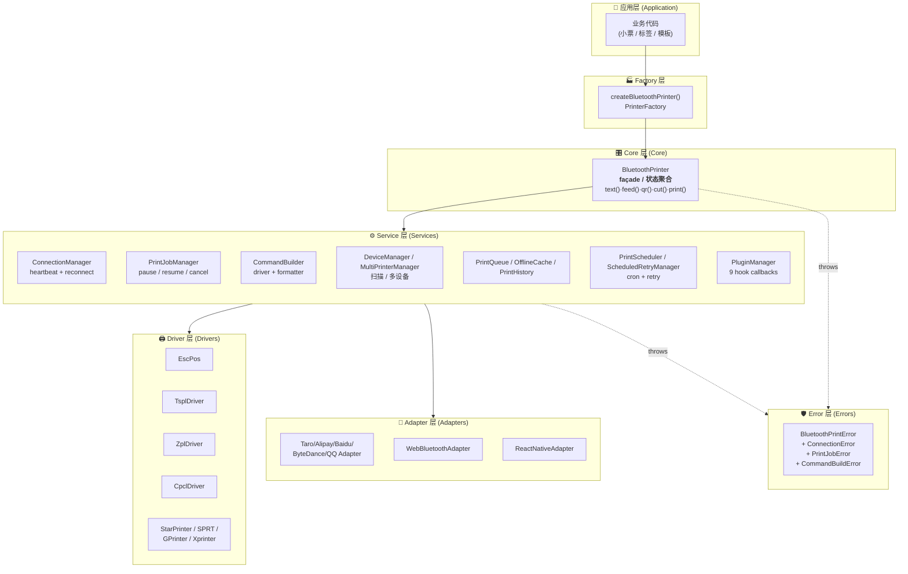
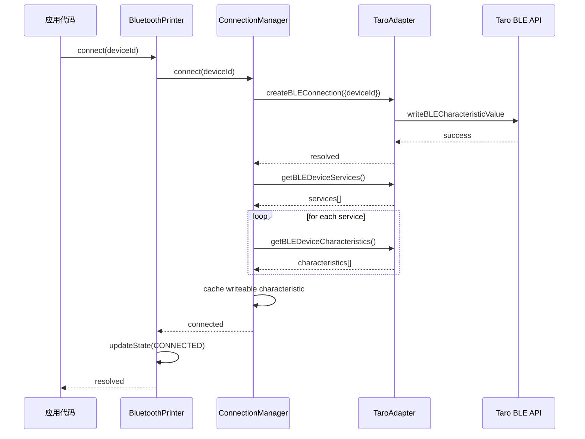
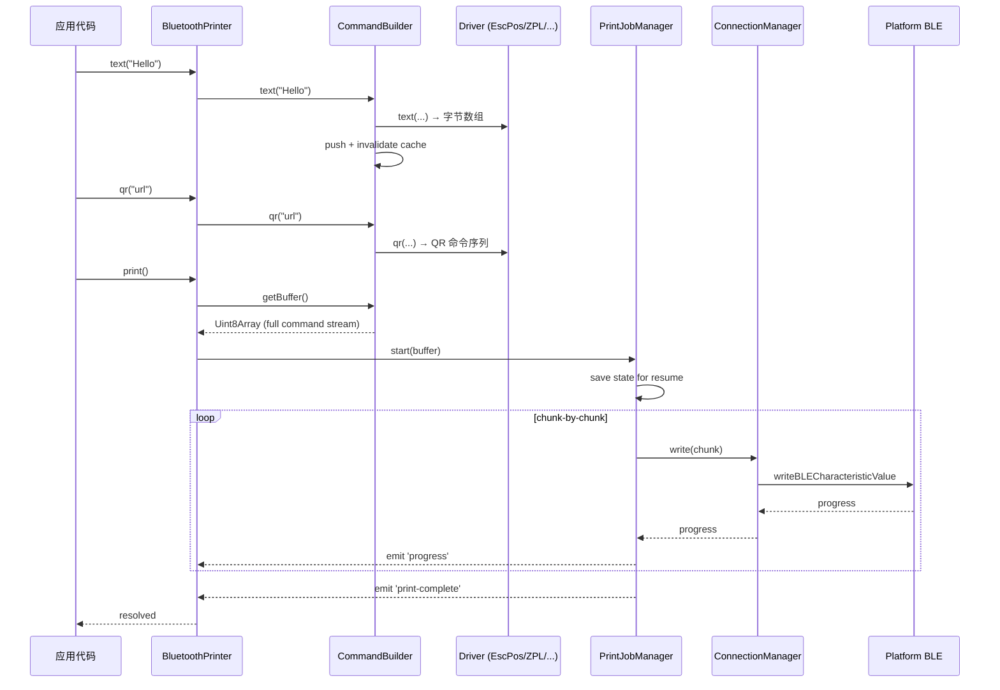

# 项目架构

深入了解 `taro-bluetooth-print` 的整体架构设计、核心模块交互和扩展机制。

## 1. 架构总览

`taro-bluetooth-print` 采用**分层 + 插件化**的架构设计，核心原则是：

1. **适配器层（Adapter Layer）** — 屏蔽不同平台的蓝牙 API 差异
2. **驱动层（Driver Layer）** — 屏蔽不同打印机指令集的差异
3. **核心服务层（Service Layer）** — 提供打印队列、缓存、统计等高级能力
4. **插件层（Plugin Layer）** — 通过 Hook 机制横切扩展核心功能
5. **错误层（Error Layer）** — 类型化错误层次结构，精确处理



### 1.1 各层职责一览

| 层 | 入口 / 抽象 | 职责 |
|:---|:---|:---|
| **Factory** | `PrinterFactory.createBluetoothPrinter()` | 接收用户配置 + 自动 dispatch 平台适配器 |
| **Core** | `BluetoothPrinter` | 单一对外 façade · 状态聚合 · 链式 API |
| **Services** | 13 个 Manager | 连接 / 任务 / 队列 / 缓存 / 重试 / 调度 / 历史 / 插件 等 |
| **Drivers** | `IPrinterDriver` | 9 种打印机协议字节序生成 |
| **Adapters** | `IPrinterAdapter` | 7 种平台 BLE API 适配 |
| **Errors** | `BluetoothPrintError` 体系 | 类型化错误层次 + `ErrorCode` enum |

## 2. 核心数据流

### 2.1 设备连接流程



### 2.2 打印流程



> 💡 关键观察：**所有 DSL 方法（text/qr/cut/image）纯同步 & 无 IO**，只有 `print()` 触发真正的异步 IO。这允许批量构建后再一次性发送，IO 次数最少化。

---

## 3. 核心模块详解

### 3.1 BluetoothPrinter（主入口）

协调 `ConnectionManager`、`PrintJobManager` 和 `CommandBuilder`，对外暴露链式打印 API：

```typescript
class BluetoothPrinter {
  private connectionManager: IConnectionManager;
  private printJobManager: IPrintJobManager;
  private commandBuilder: ICommandBuilder;

  async connect(deviceId: string): Promise<this>;
  async disconnect(): Promise<void>;
  async print(buffer?: Uint8Array): Promise<void>;

  // 链式 API
  text(content: string, encoding?: string): this;
  qr(content: string, options?: IQrOptions): this;
  feed(lines?: number): this;
  cut(): this;
  // ...

  // 打印控制
  pause(): void;
  resume(): Promise<void>;
  cancel(): void;
  remaining(): number;
}
```

### 3.2 CommandBuilder（指令构建器）

负责将链式 API 调用转换为驱动指令：

```typescript
class CommandBuilder {
  private commands: Uint8Array[] = [];

  text(content: string, encoding?: string): this;
  feed(lines?: number): this;
  image(data: Uint8Array, width: number, height: number): this;
  // ...

  getBuffer(): Uint8Array;
  reset(): void;
}
```

### 3.3 ConnectionManager（连接管理器）

管理蓝牙连接生命周期，提供写入和状态管理：

```typescript
interface IConnectionManager {
  connect(deviceId: string): Promise<void>;
  disconnect(): Promise<void>;
  write(buffer: ArrayBuffer, options?: IAdapterOptions): Promise<void>;
  getState(): PrinterState;
  getDeviceId(): string | null;
}
```

### 3.4 PrintJobManager（打印任务管理器）

管理打印任务的执行、暂停、恢复和取消：

```typescript
interface IPrintJobManager {
  isInProgress(): boolean;
  isPaused(): boolean;
  cancel(): void;
  getProgress(): PrintProgress;
}
```

---

## 4. 扩展点说明

### 4.1 扩展层次

| 扩展方式 | 适用场景 | 复杂度 |
|---------|---------|--------|
| **配置参数** | 调整分片大小、重试次数等 | 简单 |
| **插件系统** | 添加日志、重试、分析等横向功能 | 中等 |
| **自定义适配器** | 接入新的蓝牙平台 | 较复杂 |
| **自定义驱动** | 支持新的打印机协议 | 较复杂 |

### 4.2 插件 Hook 生命周期

```
onInit()
  |
beforePrint -> 执行打印 -> afterPrint -> 完成
                    |
              onError -> 重试 or 终止
```

### 4.3 扩展示例：接入新平台

```
新平台 BLE API -> 实现 IPrinterAdapter -> 注入 BluetoothPrinter
```

---

## 5. 配置层级

```
默认配置 (DEFAULT_CONFIG)
       |
       +-- PrinterConfigManager (用户保存的配置)
       |        |
       |        +-- 优先级: 全局配置 > 打印机配置 > 默认值
       |
       +-- 运行时 setOptions()（仅影响当前实例）
```

---

## 6. 错误处理策略

```
错误发生
   |
   +-- 是插件错误钩子？
   |    +-- 是 -> 插件 onError 处理
   |    +-- 否 -> 进入核心错误处理
   |
   +-- BluetoothPrintError
   |    |
   |    +-- WRITE_FAILED
   |    |    +-- retries < maxRetries? -> 延迟重试
   |    |    +-- OfflineCache.autoSync 启用? -> 缓存任务
   |    |
   |    +-- 其他错误 -> 发出 error 事件
   |
   +-- 普通 Error -> 包装为 BluetoothPrintError -> 发出
```

---

## 7. 性能关键路径

| 环节 | 优化手段 |
|------|---------|
| 蓝牙写入 | 分片传输（chunkSize）+ 可配置延迟 |
| 图像转换 | Floyd-Steinberg 抖动（Web Worker 可迁移） |
| 模板渲染 | 预编译模板函数（`engine.compile()`） |
| 批量打印 | `BatchPrintManager` 自动合并小任务 |
| 弱网适应 | `ScheduledRetryManager` 指数退避 |

---

## 8. 目录结构

```
src/
|-- index.ts                    # 主入口，导出所有公开 API
|-- types.ts                    # 核心类型定义（PrinterState, IPrinterAdapter 等）
|
|-- core/                       # 核心引擎
|   |-- BluetoothPrinter.ts     # 主入口类
|   +-- EventEmitter.ts         # 类型安全事件发射器
|
|-- services/                   # 服务层（连接 / 任务 / 队列 / 调度）
|   |-- CommandBuilder.ts       # 指令构建器
|   |-- ConnectionManager.ts    # 连接管理（心跳 + 自动重连）
|   |-- PrintJobManager.ts      # 打印任务管理（暂停 / 恢复 / 取消）
|   |-- BatchPrintManager.ts    # 批量打印管理
|   |-- CloudPrintManager.ts    # 云打印管理
|   |-- PrintHistory.ts         # 打印历史
|   |-- PrintScheduler.ts       # 打印调度（cron / 一次性 / 间隔）
|   |-- PrintStatistics.ts      # 统计服务
|   |-- PrinterStatus.ts        # 状态查询
|   |-- QRCodeDiscoveryService.ts
|   |-- QRCodeParser.ts
|   |-- ScheduledRetryManager.ts# 定时重试（指数退避）
|   +-- interfaces/             # 服务接口契约（I 前缀）
|       |-- ICommandBuilder.ts
|       |-- IConnectionManager.ts
|       +-- IPrintJobManager.ts
|
|-- adapters/                   # 平台适配器
|   |-- BaseAdapter.ts          # 基础适配器（含 MiniProgramAdapter 子类）
|   |-- ChunkWriteStrategy.ts   # 自适应 chunk 写入策略
|   |-- TaroAdapter.ts          # Taro / 微信小程序
|   |-- AlipayAdapter.ts        # 支付宝小程序
|   |-- BaiduAdapter.ts         # 百度小程序
|   |-- ByteDanceAdapter.ts     # 字节跳动小程序
|   |-- QQAdapter.ts            # QQ 小程序
|   |-- ReactNativeAdapter.ts   # React Native（react-native-ble-plx）
|   |-- WebBluetoothAdapter.ts  # Web Bluetooth（H5）
|   +-- AdapterFactory.ts       # 适配器工厂（平台自动检测）
|
|-- drivers/                    # 打印机驱动
|   |-- EscPosDriver.ts         # ESC/POS 热敏票据（默认）
|   |-- TsplDriver.ts           # TSPL 标签机
|   |-- ZplDriver.ts            # ZPL Zebra 工业机
|   |-- CpclDriver.ts           # CPCL HP / 霍尼韦尔
|   |-- StarPrinter.ts          # STAR TSP 系列
|   |-- GPrinterDriver.ts       # 佳博 GP 系列
|   |-- XprinterDriver.ts       # 芯烨 X 系列
|   |-- SprtDriver.ts           # 思普瑞特
|   +-- BarcodeHelpers.ts       # 条码便捷方法 mixin
|
|-- plugins/                    # 插件系统
|   |-- PluginManager.ts        # 插件管理器
|   |-- PluginTypes.ts          # 插件类型定义
|   +-- builtin/                # 内置插件
|       |-- LoggingPlugin.ts    # 日志插件
|       +-- RetryPlugin.ts      # 重试插件
|
|-- template/                   # 模板引擎
|   |-- TemplateEngine.ts       # 模板引擎（loop / condition / border / table）
|   |-- engines/
|   |   +-- TemplateRenderer.ts # 渲染器
|   +-- parsers/
|       +-- TemplateParser.ts   # 解析器
|
|-- barcode/
|   +-- BarcodeGenerator.ts     # 条码生成器（QR / PDF417）
|
|-- cache/
|   +-- OfflineCache.ts         # 离线缓存
|
|-- queue/
|   +-- PrintQueue.ts           # 打印队列
|
|-- formatter/
|   +-- TextFormatter.ts        # 文本格式化
|
|-- preview/
|   +-- PreviewRenderer.ts      # 打印预览
|
|-- encoding/
|   |-- EncodingService.ts      # 编码服务
|   |-- GbkTable.ts             # GBK 完整编码表
|   |-- GbkLite.ts              # GBK 精简编码表（106 条）
|   |-- GbkData.ts              # GBK / Big5 全量数据
|   +-- KoreanJapanese.ts       # 韩文 / 日文编码
|
|-- device/
|   |-- DeviceManager.ts        # 设备扫描管理
|   |-- DiscoveryService.ts     # 增强型设备发现
|   +-- MultiPrinterManager.ts  # 多打印机管理
|
|-- factory/
|   +-- PrinterFactory.ts       # 工厂模式入口
|
|-- config/
|   |-- PrinterConfig.ts        # 配置定义
|   +-- PrinterConfigManager.ts # 配置管理
|
|-- errors/                     # 错误类型（PascalCase 文件名）
|   |-- BaseError.ts            # BluetoothPrintError 基类 + ErrorCode enum
|   |-- ConnectionError.ts
|   |-- CommandBuildError.ts
|   +-- PrintJobError.ts
|
|-- constants/
|   +-- strings.ts              # 公共字符串常量
|
+-- utils/                      # 通用工具
    |-- encoding.ts             # 编码工具
    |-- image.ts                # 图像工具
    |-- logger.ts               # 日志工具
    |-- platform.ts             # 平台检测
    |-- uuid.ts                 # UUID 工具
    |-- bitmap.ts               # 位图工具
    |-- normalizeError.ts       # 错误标准化
    |-- errorHandler.ts         # 错误处理
    |-- outputLimiter.ts        # 输出限制器
    +-- withTimeout.ts          # 超时辅助
```

> **命名规范**（v2.14.0 冻结）：
> - 类文件 PascalCase：`BluetoothPrinter.ts`、`BaseError.ts`、`EscPosDriver.ts`
> - 工具 / 常量 / 数据文件 camelCase：`encoding.ts`、`uuid.ts`、`strings.ts`、`GbkData.ts`
> - 接口 `I` 前缀：`IPrinterAdapter`、`IConnectionManager`、`ICommandBuilder`
> - 类成员无下划线前缀：`isPaused`（非 `_isPaused`）
> - 事件名 kebab-case：`state-change`、`print-complete`
