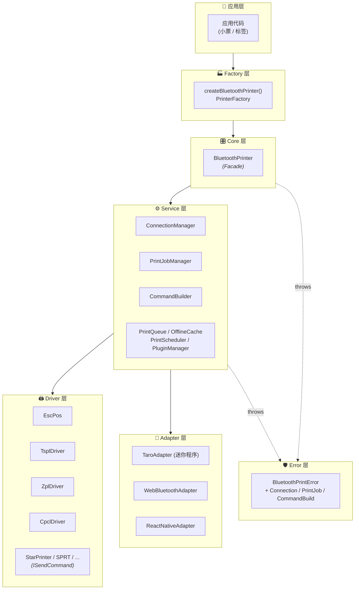

<div class="badges-row" style="text-align:center; margin-top:1rem; margin-bottom:2rem;">
  <a href="https://www.npmjs.com/package/taro-bluetooth-print" target="_blank">
    
  </a>
  <a href="https://www.npmjs.com/package/taro-bluetooth-print" target="_blank">
    
  </a>
  <a href="https://bundlephobia.com/package/taro-bluetooth-print" target="_blank">
    
  </a>
  <a href="https://github.com/agions/taro-bluetooth-print/blob/main/LICENSE" target="_blank">
    
  </a>
  <a href="https://github.com/agions/taro-bluetooth-print/actions" target="_blank">
    
  </a>
  <a href="https://github.com/agions/taro-bluetooth-print/stargazers" target="_blank">
    
  </a>
</div>

## ⚡ 快速开始

**仅需几行代码，即可完成跨端蓝牙打印：**

```bash
# 推荐使用 pnpm
pnpm add taro-bluetooth-print
```

```typescript
import { createBluetoothPrinter, WebBluetoothAdapter } from 'taro-bluetooth-print';

// ① 创建打印机（自动 dispatch 当前平台适配器）
const printer = createBluetoothPrinter({
  adapter: new WebBluetoothAdapter(),
});

// ② 连接 BLE 设备
await printer.connect('device-id-xxx');

// ③ 链式 API 构建小票
await printer
  .text('=== 欢迎光临 ===', 'GBK')
  .feed()
  .text('商品A     x1    ¥10.00', 'GBK')
  .text('商品B     x2    ¥20.00', 'GBK')
  .feed()
  .text('------------------------')
  .text('合计：            ¥30.00', 'GBK')
  .feed(2)
  .qr('https://example.com', { size: 6 })
  .feed(2)
  .cut()
  .print();

// ④ 断开
await printer.disconnect();
```

## 🏗️ 架构设计

一个清晰分层的 6 层架构 — **每一层只与相邻层耦合**：



> 💡 **设计原则**：依赖单向流动 · interface 抽象掉具体实现 · 插件 hook 横切所有层。

## 📋 平台 & 驱动矩阵

|  | ESC/POS | TSPL | ZPL | CPCL | STAR |
|:---:|:---:|:---:|:---:|:---:|:---:|
| 微信小程序 | ✅ | ✅ | ✅ | ✅ | ✅ |
| 支付宝小程序 | ✅ | ✅ | ✅ | ✅ | ✅ |
| 百度小程序 | ✅ | ✅ | ✅ | ✅ | ✅ |
| 字节跳动小程序 | ✅ | ✅ | ✅ | ✅ | ✅ |
| QQ 小程序 | ✅ | ✅ | ✅ | ✅ | ✅ |
| H5（Web Bluetooth） | ✅ | ✅ | ✅ | ✅ | ✅ |
| React Native | ✅ | ✅ | ✅ | ✅ | ✅ |
| 鸿蒙 HarmonyOS | ✅ | ✅ | ✅ | ✅ | ✅ |

> 全部驱动 = `new EscPos()` / `new TsplDriver()` / `new ZplDriver()` / `new CpclDriver()` / `new StarPrinter()`，全部在 `drivers/index.ts` 命名导出。

## 🌟 核心亮点

<div class="feature-grid">
  <div class="feature-card">
    <h4>📦 极致轻量</h4>
    <p>minzip <strong>~231 KB</strong>，零运行时依赖，tree-shaking 友好</p>
  </div>
  <div class="feature-card">
    <h4>💎 类型安全</h4>
    <p>TypeScript 严格模式 + 完整 <code>I-prefix</code> interface 契约</p>
  </div>
  <div class="feature-card">
    <h4>🧪 测试覆盖</h4>
    <p><strong>1,102 个测试</strong> 100% 通过，jscpd 0 重复，零死代码</p>
  </div>
  <div class="feature-card">
    <h4>🧩 可组合</h4>
    <p>Plugin hook 系统 · 9 个生命周期钩子 · 类型化错误层次</p>
  </div>
  <div class="feature-card">
    <h4>🔌 多语言</h4>
    <p>GBK / GB2312 / Big5 / UTF-8 / EUC-KR / Shift-JIS / ISO-2022-JP</p>
  </div>
  <div class="feature-card">
    <h4>🎨 Floyd-Steinberg</h4>
    <p>6 种抖动算法 + 缩放/预处理/海报化，完美的图像转打印</p>
  </div>
</div>

<style scoped>
.feature-grid {
  display: grid;
  grid-template-columns: repeat(auto-fit, minmax(220px, 1fr));
  gap: 1rem;
  margin: 2rem 0;
}
.feature-card {
  padding: 1.25rem;
  border: 1px solid var(--vp-c-divider);
  border-radius: 12px;
  background: var(--vp-c-bg-soft);
  transition: transform 0.2s, box-shadow 0.2s;
}
.feature-card:hover {
  transform: translateY(-2px);
  box-shadow: 0 8px 24px rgba(99, 102, 241, 0.08);
}
.feature-card h4 {
  margin: 0 0 0.5rem;
  font-size: 1.05rem;
}
.feature-card p {
  margin: 0;
  font-size: 0.875rem;
  color: var(--vp-c-text-2);
  line-height: 1.6;
}
.feature-card strong {
  color: var(--vp-c-brand-1);
  font-weight: 700;
}
</style>

## 🧭 下一步

| 我想... | 跳转 |
|:---|:---|
| 5 分钟跑通第一个 Demo | [→ 快速开始](/guide/getting-started) |
| 弄清分层架构与核心概念 | [→ 核心概念](/guide/core-concepts) |
| 看完整 API 与示例 | [→ API 参考](/api/) |
| 找 1,000+ 台适配的打印机型号 | [→ 驱动支持](/guide/drivers) |
| 解决具体报错 | [→ 故障排查](/guide/troubleshooting) |
| 看 FAQ | [→ 常见问题](/guide/faq) |

<div style="text-align:center; margin-top:3rem; padding:2rem 0; color:#888; font-size:0.9rem; border-top:1px solid var(--vp-c-divider);">
  <strong>MIT License</strong> · Made with ❤️ by <a href="https://github.com/Agions" target="_blank">Agions</a> · <a href="https://github.com/Agions/taro-bluetooth-print" target="_blank">⭐ Star on GitHub</a>
</div>
